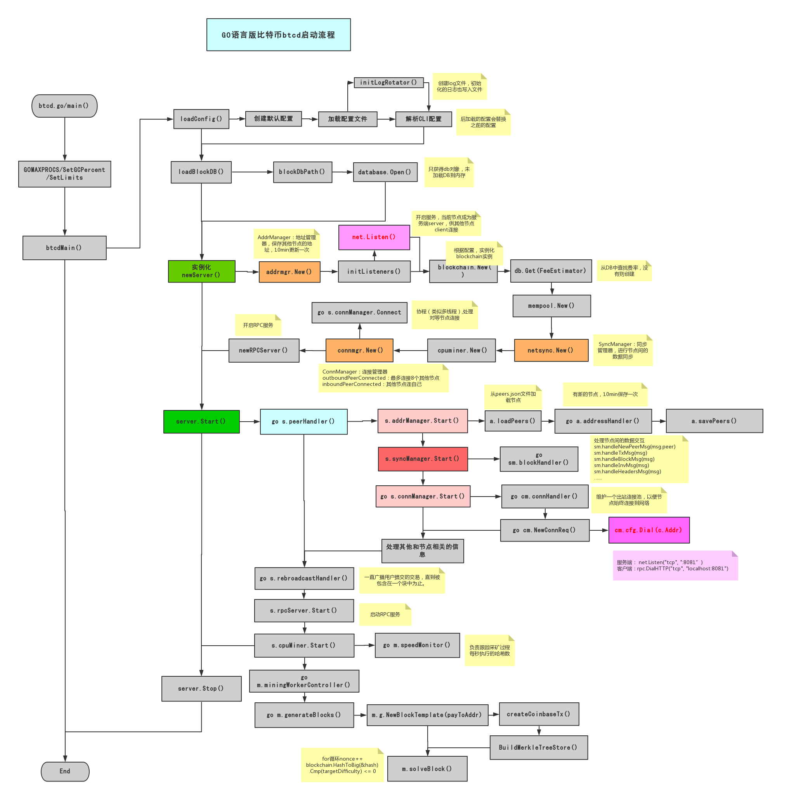
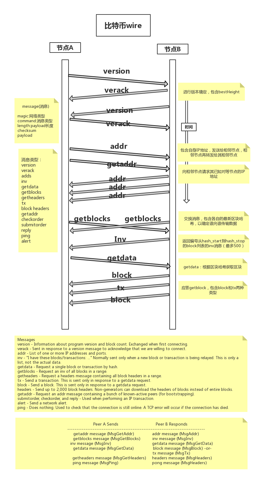

# btcd解读

## bctd目录

    addmgr ：进行peer地址的管理, 主要是一些本地的工作，不涉及直接的网络连接或传输；10min保存一次IP地址到文件中
    blockchain ：实现比特币区块处理和链选择规则;./fullblocktests : 提供一组用于测试共识验证规则的块测试
    btcec ：实现对比特币脚本所需的椭圆曲线密码函数的支持
    btcjson ：为底层的json-rpc命令和返回值提供一个扩展api
    chaincfg ：比特币的参数配置，包括地址头，genesis哈希等
    connmgr ：进行peer之间连接的管理。发现新的peer节点，建立连接；对等节点关闭，关闭连接。连接别人的列表，被别人连接的列表。建立连接是需要对方peer的地址，这依赖于addrManager中管理的地址。
    database ： 为比特币区块链提供数据库接口。基于leveldb，参考boltdb，开发了上层的api
    mempool ： 比特币交易池
    mining ： PoW挖矿
    netsync ： 同步管理器，用于统一处理各个节点发送和接收到的数据，以便同步区块链和同步交易。
    peer ： 实现了P2P网络中peer之间维持连接及收发wire协议消息的机制。
    rpcclient ： 实现一个强大且易于使用的支持websocket的比特币json-rpc客户端
    txscript ： 实现比特币交易脚本语言
    wire ： 实现bitcoin网络协议，定义理论peers之间的协议消息，消息格式及包的封装和解析等。

## btcd启动流程

    P2P原理:
        服务端： net.Listen("tcp", ":8081")
        客户端：rpc.DialHTTP("tcp", "localhost:8081")
 
        
## 比特币数据传输协议

## 数据存储

基于leveldb，参照boltdb的接口规范，在leveldb上封装了一层

leveldb代码阅读笔记
https://www.codedump.info/post/20190215-leveldb/

boltdb 源码分析
https://youjiali1995.github.io/storage/boltdb/

blotdb源码
https://github.com/boltdb/bolt

## 参考内容

https://www.jianshu.com/p/87379ab05993

https://en.bitcoin.it/wiki/Protocol_documentation#inv

btcd源码地址：https://github.com/btcsuite/btcd

《精通比特币》（第二版）

### 后言

go语言相比c++容易许多，熟悉语法即可看懂相关代码；go语言容易调试，将go项目下载放在go的默认目录后，找到btcd.go/main()入口，debug几遍程序，即可明白btcd启动的整个流程。